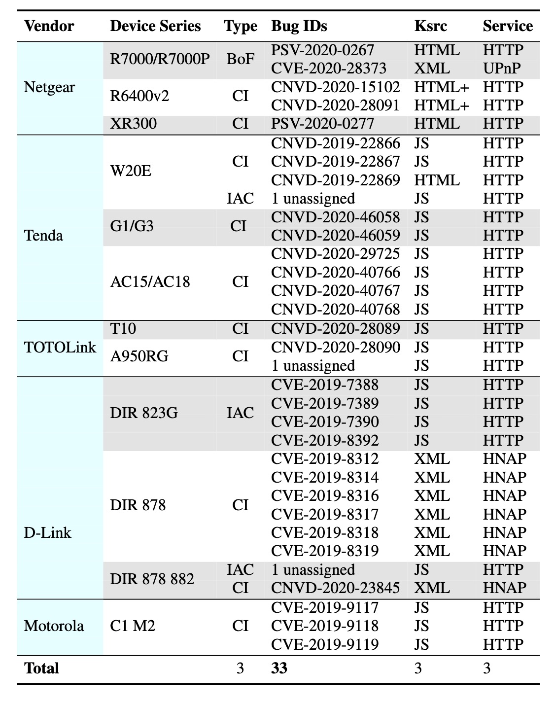

# SaTC
[Chinese Version.](README_CN.md)

A prototype of Shared-keywords aware Taint Checking(SaTC), a static analysis method that tracks user input between front-end and back-end for vulnerability discovery effectively and efficiently. 

## Overview of SaTC


## Research paper

We present our approach in the following research paper accepted at the 30th USENIX Security Symposium:

**Sharing More and Checking Less: Leveraging Common Input Keywords to Detect Bugs in Embedded Systems** 
[[PDF]](https://www.usenix.org/system/files/sec21fall-chen-libo.pdf)  


## Running Environment

We provide a usable Docker environment and a Dockerfile that can be used to build Docker images.

### Use the compiled docker environment directly

```shell script
# Get image from Docker hub 
docker pull smile0304/satc

# Run SaTC (Need to add mapping directory by yourself)
docker run -v <mapping>:<mapping> -it smile0304/satc
```

### Or build it by dockerfile

```shell script
# Cd SaTC code directory
cd SaTC

# Use Dockerfile to build docker image
docker build . -t satc

# Run SaTC (Need to add mapping directory by yourself)
docker run -v <mapping>:<mapping> -it satc
```

## Instructions for running this tool

```text
Usage: satc.py [-h] -d /root/path/_ac18.extracted -o /root/output
               [--ghidra_script {ref2sink_cmdi,ref2sink_bof,share2sink,ref2share,all}]
               [--save_ghidra_project] --taint_check
               [-b /var/ac18/bin/httpd | -l 3]

Arguments:
  -h, --help            Show help in details
  -d /root/path/_ac18.extracted, --directory /root/path/_ac18.extracted
                        File system uncompressed from firmware
  -o /root/output, --output /root/output
                        Directory result saved
  --ghidra_script {ref2sink_cmdi,ref2sink_bof,share2sink,ref2share,all}
                        (Option) Specify the Ghidra script to be used. If you use the `all` command, the three scripts `ref2sink_cmdi`,`ref2sink_bof` and `ref2share` will be run at the same time
  --ref2share_result /root/path/ref2share_result 
                        (Option) When running the `share2sink` Ghidra script, you need to use this parameter to specify the output result of the `ref2share` script
  --save_ghidra_project (Option) Save the ghidra project generated during analysis
  --taint_check         (Option) Use taint analysis engine for analysis
  -b /var/ac18/bin/httpd, --bin /var/ac18/bin/httpd  OR `-b httpd` , `--bin httpd`    
                        (Option) Used to specify the program to be analyzed, if not specified, SaTC will leverage the built-in algorithm to match targeted bin
  -l num, --len num     (Option) To set the top N programs to be defined as the border bins in our matching results[Default value is 3]
```

#### Ghidra script

- `ref2sink_cmdi`: The script to discover the paths of the command injection type sink function from the reference of the given shared-keywords.
- `ref2sink_bof` : The script to discover the paths of the buffer overflow type sink function from the reference of the given shared-keywords.
- `ref2share` : This script to find parameters in shared data handling functions, such as `nvram_set`, `setenv` or other similar functions. Need to be used in conjunction with share2sink.
- `share2sink` : This script is corresponding to `ref2share`, such as `nvram_get`, `getenv` or other functions. Need to be used in conjunction with `ref2share`, and the input of this script is the output from the `ref2share` script.

#### Output 
Directory structure：

```shell
|-- ghidra_extract_result
|   |-- httpd
|       |-- httpd
|       |-- httpd_ref2sink_bof.result
|       |-- httpd_ref2sink_cmdi.result
|       |-- httpd_ref2sink_cmdi.result-alter2
|-- keyword_extract_result
|   |-- detail
|   |   |-- API_detail.result
|   |   |-- API_remove_detail.result
|   |   |-- api_split.result
|   |   |-- Clustering_result_v2.result
|   |   |-- File_detail.result
|   |   |-- from_bin_add_para.result
|   |   |-- Not_Analysise_JS_File.result
|   |   |-- Prar_detail.result
|   |   |-- Prar_remove_detail.result
|   |-- info.txt
|   |-- simple
|       |-- API_simple.result
|       |-- Prar_simple.result
|-- result-httpd-ref2sink_cmdi-ctW8.txt
```

Need to follow such important directories:

- keyword_extract_result/detail/Clustering_result_v2.result : The match of front-end keywords in bin. Input for the `Input Entry Recognition` module
- ghidra_extract_result/{bin}/* : Analysis result of ghidra script. Input for `Input Sensitive Taint Analysise` module
- result-{bin}-{ghidra_script}-{random}.txt: taint analysis result

Other directories:

```shell
|-- ghidra_extract_result # ghidra looks for the analysis results of the function call path, enabling the `--ghidra_script` option will output the directory
|   |-- httpd # Each bin analyzed will generate a folder with the same name
|       |-- httpd # Bin being analyzed
|       |-- httpd_ref2sink_bof.result # Locate BoF sink function path
|       |-- httpd_ref2sink_cmdi.result # Locate CmdI sink function path
|-- keyword_extract_result  # Keyword extraction results
|   |-- detail  # Front-end keyword extraction results (detailed analysis results)
|   |   |-- API_detail.result # Detailed results of the extracted API
|   |   |-- API_remove_detail.result # API information filtered out
|   |   |-- api_split.result  # Matching API results
|   |   |-- Clustering_result_v2.result # Detailed matching results 
|   |   |-- File_detail.result  # Keywords extracted from each file
|   |   |-- from_bin_add_para.result # Share-keywords generated during binary matching
|   |   |-- Not_Analysise_JS_File.result #Igored JS files by common lib matching
|   |   |-- Prar_detail.result # Detailed results of extracted Prarmeters
|   |   |-- Prar_remove_detail.result # Detailed results of filtered Prarmeters
|   |-- info.txt  # Record processing time and other information
|-- result-httpd-ref2sink_cmdi-ctW8.txt # a typical result file that enable `--taint-check` and `--ghidra_script` options
```

#### Our dataset

You should download dataset from [SaTC_dateset.zip](https://drive.google.com/file/d/1rOhjBlmv3jYmkKhTBJcqJ-G56HoHBpVX/view?usp=sharing).

#### Case Study

1. To discover command injection and buffer overflow bugs in D-Link 878
```shell script
python satc.py -d /home/satc/dlink_878 -o /home/satc/res --ghidra_script=ref2sink_cmdi --ghidra_script=ref2sink_bof --taint_check
```

2. To discover command injection bugs in specific target `prog.cgi` of D-Link 878 
```shell script
python satc.py -d /home/satc/dlink_878 -o /home/satc/res --ghidra_script=ref2sink_cmdi -b prog.cgi --taint_check
```

3. To discover command injection bugs in multi-bin of D-Link 878, setting input data in `prog.cgi` and sink functions in `rc` 
```shell script
python satc.py -d /home/satc/dlink_878 -o /home/satc/res --ghidra_script=ref2share -b prog.cgi

python satc.py -d /home/satc/dlink_878 -o /home/satc/res --ghidra_script=share2sink --ref2share_result=/home/satc/res/ghidra_extract_result/prog.cgi/prog.cgi_ref2share.result --ghidra_script=ref2sink_cmdi -b rc --taint_check
```

#### Real-world Vulnerabilities

As shown below, SaTC detected 33 previously unknown bugs, and at the time of paper writing, 30 of them have been confirmed by their developers. 25 bugs are command injection vulnerabilities; two of them are buffer overflow bugs; the other six belong to incorrect access control which could result in privacy disclosure. 


