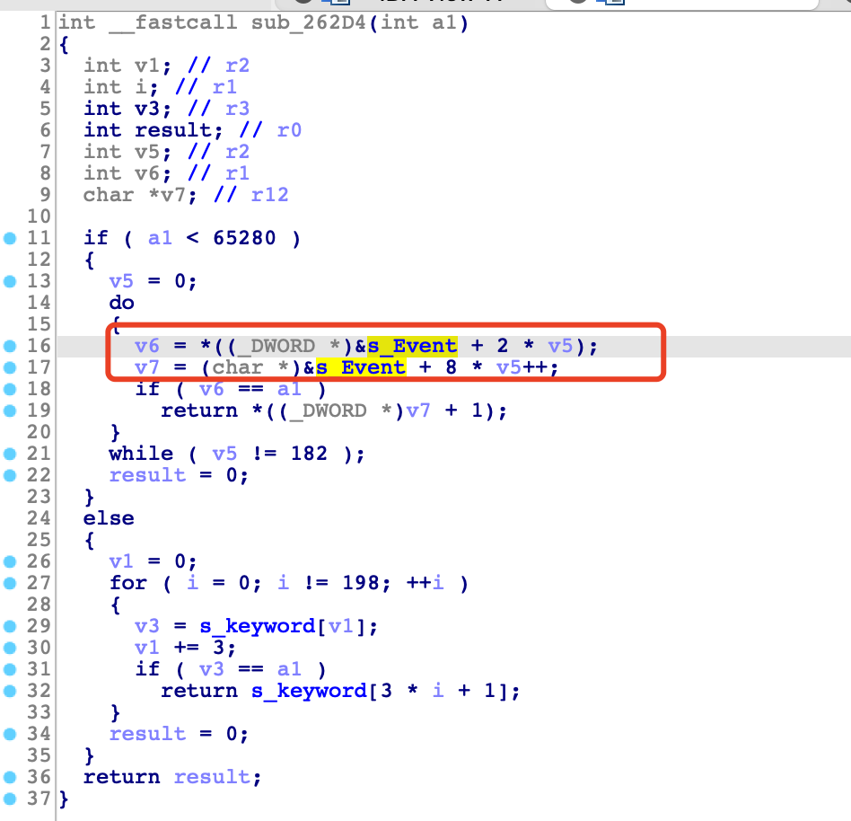
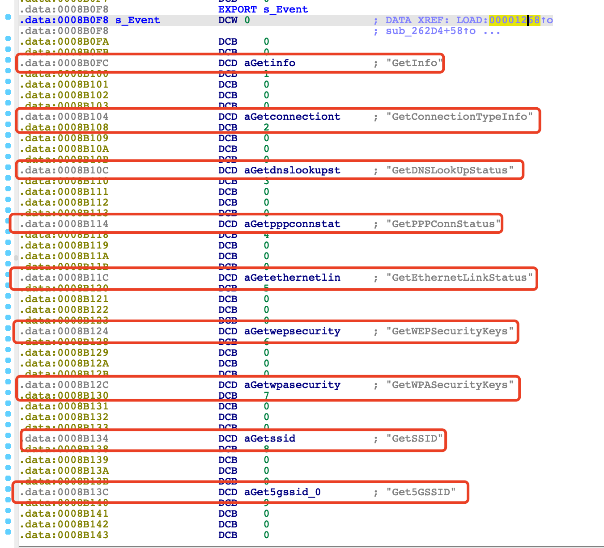

## Action关键字验证
在我们人工验证的过程中发现，NetGear upnpd的action关键字位于一个数组中. 当有新的upnp请求进来时，upnpd会遍历action关键字数组，找到与请求想匹配的字符串，交给处理函数处理。如果从前端提取的action关键字同时存在在这个数组中，我们就认为此action关键字被引用。所以对比结果为100%

以`R6400`的`upnpd`为例：
在`SUB_262D4`这个函数中使用了一个字符数组，当有UPNP请求进来时，会根据这个字符数组来判断应该交付给哪一个函数进行处理:

`s_Event`的数组中记录的内容:

