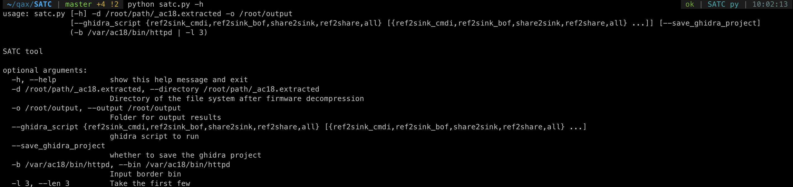

## SATC

Program Home:




Instructions:
```
usage: satc.py [-h] -d /root/path/_ac18.extracted -o /root/output
               [--ghidra_script {ref2sink_cmdi,ref2sink_bof,share2sink,ref2share,all} [{ref2sink_cmdi,ref2sink_bof,share2sink,ref2share,all} ...]] [--save_ghidra_project]
               (-b /var/ac18/bin/httpd | -l 3)

SATC tool

optional arguments:
  -h, --help            show this help message and exit
  -d /root/path/_ac18.extracted, --directory /root/path/_ac18.extracted
                        Directory of the file system after firmware decompression
  -o /root/output, --output /root/output
                        Folder for output results
  -b filename, --bin /var/ac11/2834
                        RTOS program
```


-d 指定解压固件目录(必须)

-o 指定结果输出目录(必须)

-b 指定边界程序路径(必须)，指定RTOS程序


## 运行步骤:

1. 运行前先进入jsparse目录运行 `npm run start` ,或者使用docker运行
> docker build . -t jsparse

> docker run -itd 3000:3000 jsparse

2. 运行程序即可


### 当前的情况


当前的环境支持了Vxworks系统关键字的提取。binwalk解压vxworks,可以得到部分静态文件，但是无法识别出文件名。修改过后的代码可根据文件头信息尝试识别文件类型。


#### 问题:
当前对ECOS固件无法完美支持(Tenda AC11), 由于AC11的固件解压出来为一个单独的bin，所有文件封装在其中，如果通过strings提取，无法判断文件的结尾。目前解决思路:
- 对HTML：从html中匹配可能作为参数的变量教容易，正则匹配即可，所以没必要一定要读到代码结束，分开匹配即可
- 对JS：由于需要对Javascript代码转换成AST语法树，所以必须要读到代码结束，否则语法错误无法解析。
  - 如果找到了准确识别JS文件结尾的方法可直接调用`JSParser.parse_js_str(code="JS代码")`即可提取.
